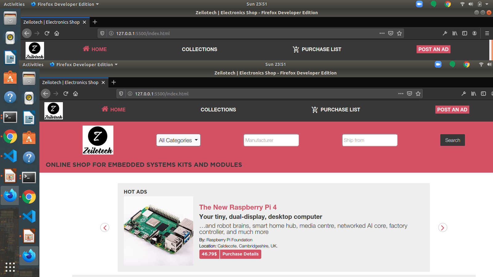
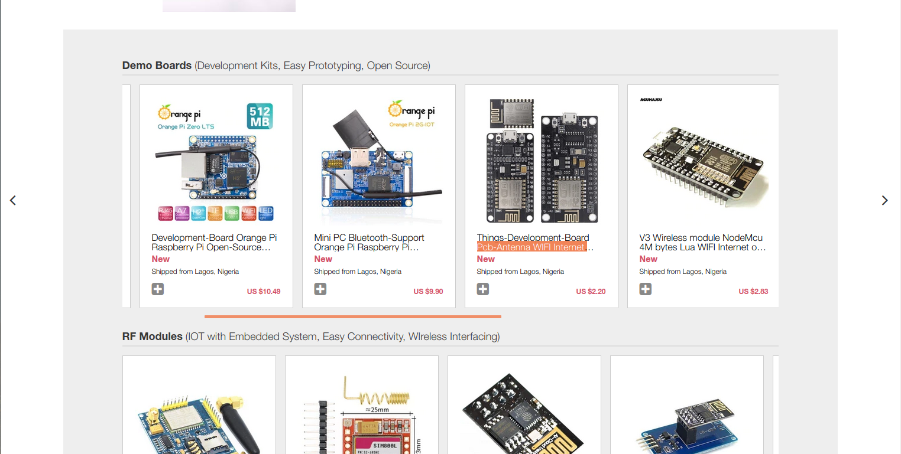
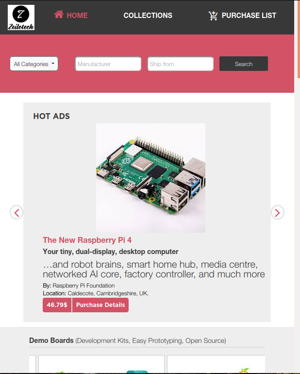
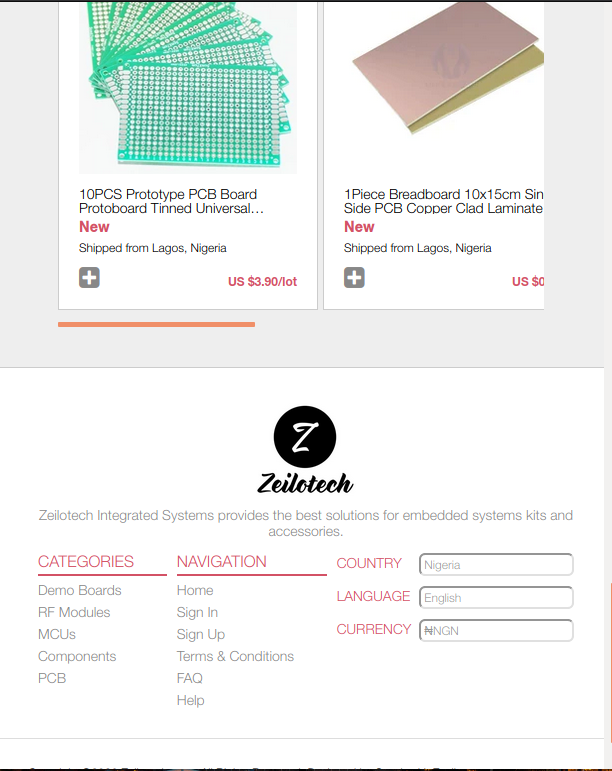
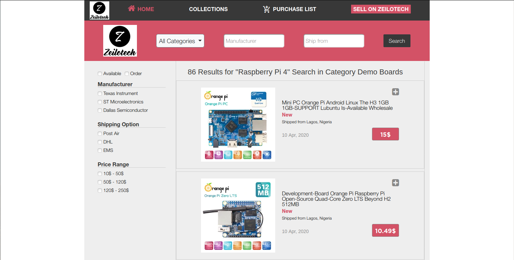
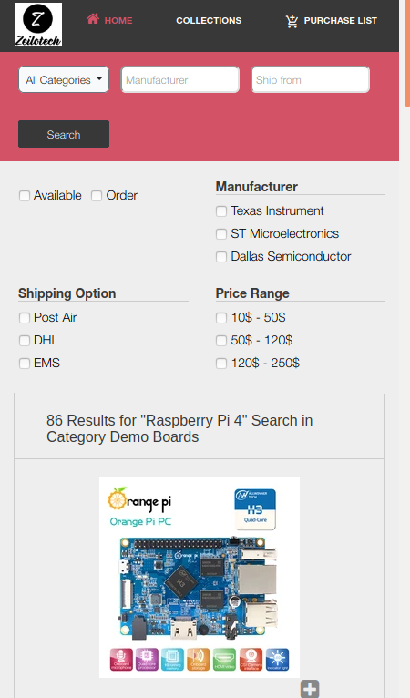
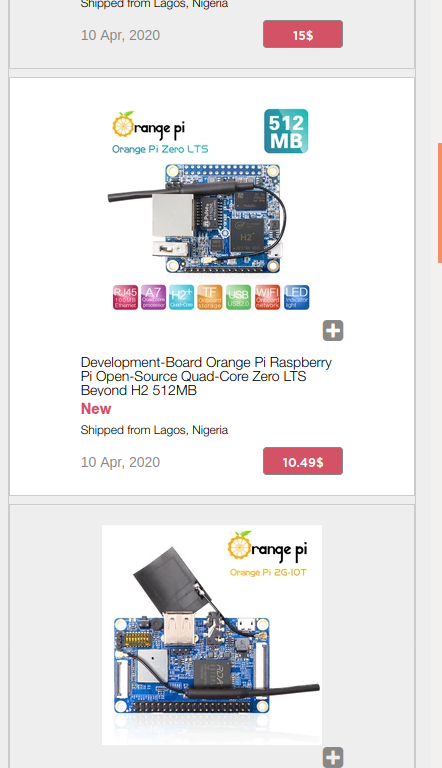
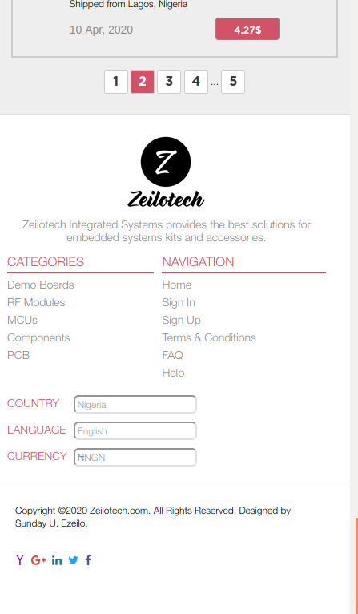

## HTML &amp; CSS Capstone Project: Online Shop For Electronics

> This is my HTML & CSS Capstone Project. I created an online shop for electronics. I completed the project using HTML5 and the basic CSS3 layouts which include flexbox and grid. The project features two breakpoints; Mobile and Tablet/Desktop versions. It is fully responsive as requirement specifications.

## Project Screenshots here:

## Features

- Mobile Version
- Desktop Version
- Product Page
- Search Result Page

## Built With

- HTML5
- CSS3
- Bootstrap 4.4.1

## Layouts

- Flexbox
- CSS Grid Layout

## Live Demo

[Zeilotech Electronics Online Store](https://raw.githack.com/ezeilo-su/html-css-capstone/dev/index.html)

## Author

👤 **Sunday Uche Ezeilo**

- Github: [@sundayezeilo](https://github.com/ezeilo-su)
- Twitter: [@SundayEzeilo](https://twitter.com/SundayEzeilo)
- Linkedin: [Sunday Ezeilo](https://www.linkedin.com/in/sunday-ezeilo-a6a67664/)

## 🤝 Contributing

Contributions, issues and feature requests are welcome!

Feel free to check the [issues page](https://github.com/ezeilo-su/html-css-capstone/issues)

## Show your support

Show support by giving a ⭐️ if you like this project!
